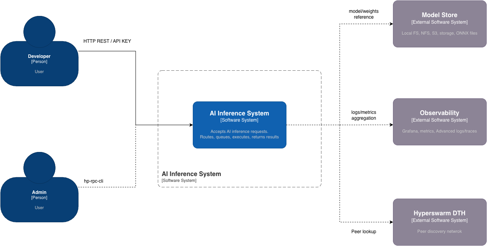
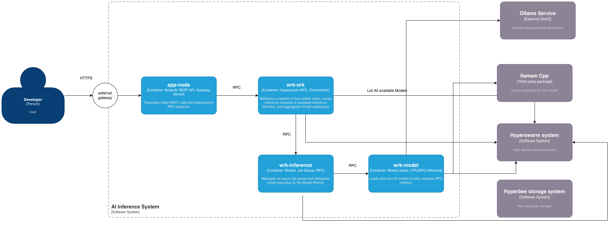
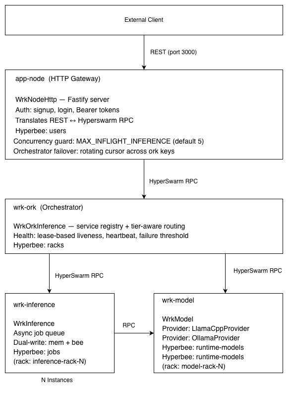
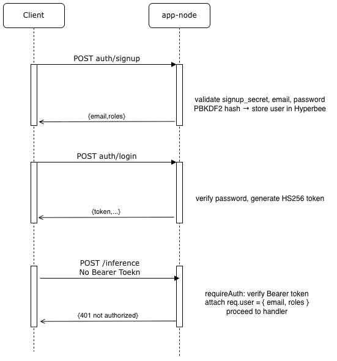
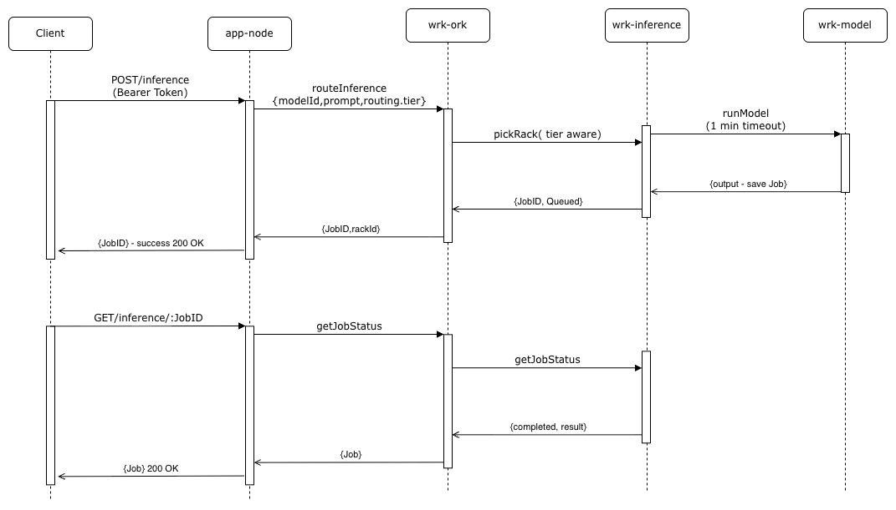
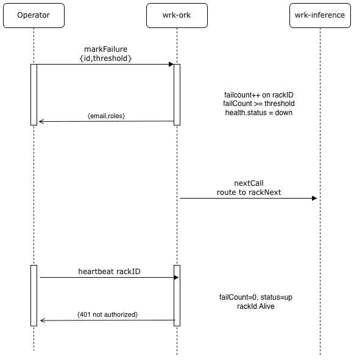
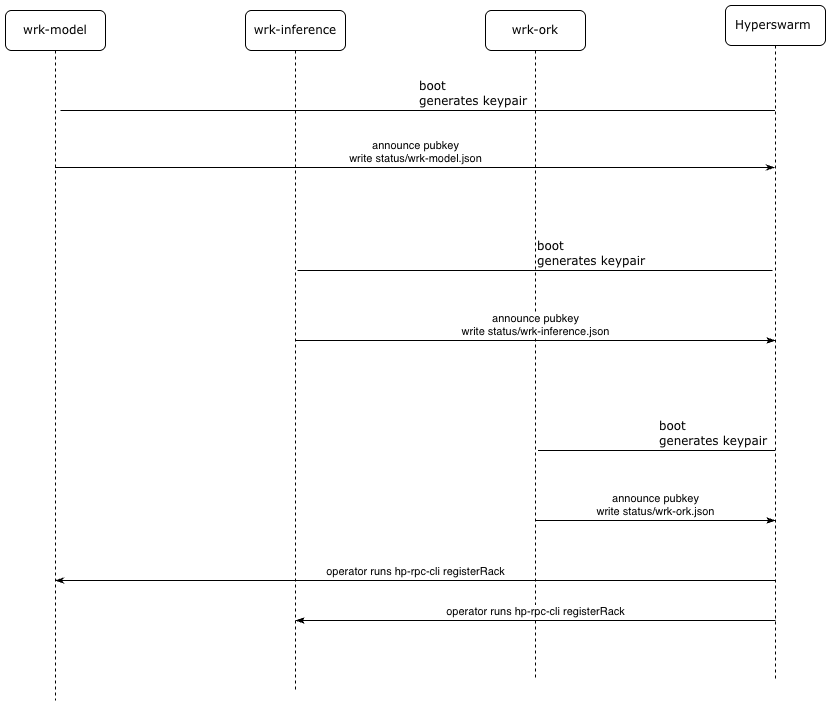

# AI Inference Platform — System Design Document

**Version 1.0** — 8 March 2026

---

## Table of Contents

1. [Background](#1-background)
2. [Requirements](#2-requirements)
3. [Design Considerations](#3-design-considerations)
4. [Assumptions & Dependencies](#4-assumptions--dependencies)
5. [General Constraints](#5-general-constraints)
6. [Goals & Objectives](#6-goals--objectives)
7. [Executive Summary](#7-executive-summary)
8. [Overall Architecture](#8-overall-architecture)
9. [Services Drill Down](#9-services-drill-down)
10. [User Flow Diagrams](#10-user-flow-diagrams)
11. [Audit & Observability](#11-audit--observability)
12. [Error Codes Reference](#12-error-codes-reference)
13. [Configuration Reference](#13-configuration-reference)
14. [Future Extensions](#14-future-extensions)

---

## 1. Background

Demand for on-demand AI inference keeps growing. Most inference platforms lean on centralised API gateways and managed model-serving infrastructure — that works, but it introduces a single point of failure, pushes traffic through expensive cloud routing, and makes it hard to run models fully on-premise or across geographically distributed nodes.

This document covers an **AI Inference Platform as a Service** built on top of [Hyperswarm RPC](https://github.com/holepunchto/rpc) — a peer-to-peer, encrypted RPC framework based on the Hypercore Protocol. Each service registers a public key on a distributed hash table (DHT) and talks directly to peers, no central broker involved.

The focus is text generation, backed by a **two-provider runtime model**: local GGUF inference through `node-llama-cpp` and remote inference through `ollama`. Models can be registered on the fly — swapping or adding them doesn't require a restart.

At a high level, the platform:

- Lets clients submit inference requests over plain HTTP, secured with per-user Bearer tokens.
- Routes requests internally across worker microservices via Hyperswarm RPC, with tier-aware load balancing (premium / standard).
- Loads and runs AI models on designated GPU/CPU nodes through pluggable provider backends (llama-cpp, ollama).
- Scales horizontally — spin up new worker instances and they self-register with the orchestrator.
- Tracks rack health with a lease-based liveness system, heartbeats, and failure thresholds.

---

## 2. Requirements

### 2.1. Functional Requirements

1. **Inference API** — Clients post a `{ modelId, prompt, params }` payload and get back a job ID.
2. **Job lifecycle** — Clients poll job status (`queued → running → completed | failed | cancelled`).
3. **Job cancellation & listing** — Clients can cancel a running or queued job, and list jobs with an optional status filter and pagination (default limit 50).
4. **Model catalogue** — Clients can see which AI models are available across all model workers, including ones registered at runtime.
5. **Runtime model registration** — New models can be added at runtime through `registerModel` RPC. The registration is persisted in the `runtimeModels` Hyperbee and survives restarts. If `autoload: true`, the model is loaded into memory straight away.
6. **Multi-provider model support** — The Model Worker uses a pluggable provider abstraction for inference backends. Two providers ship today: `llama-cpp` (local GGUF via `node-llama-cpp`) and `ollama` (remote via HTTP to a local Ollama server). Adding a new provider means extending `LLMProvider`.
7. **Automatic model download** — Models whose `source.type === 'huggingface'` are pulled from Hugging Face Hub automatically at load time, with optional token auth via an environment variable.
8. **Service registration** — Workers register themselves with the orchestrator on boot via `registerRack` — no hard-coded addresses needed.
9. **Service discovery** — The orchestrator resolves RPC keys by service type, so it can route requests to whichever worker is available.
10. **Rack management** — The orchestrator exposes APIs to register, list, deregister, heartbeat, and mark-failure on worker racks at runtime.
11. **Health & lease management** — Each rack carries a health state (`up` / `down`) with lease-based expiry (`leaseMs` + `lastSeenAt`). `heartbeatRack` refreshes liveness; `markRackFailure` bumps a failure counter and flips the rack to `down` once a configurable threshold (default 3) is hit.
12. **Tier-based routing** — Premium and enterprise users get routed to dedicated racks first. Standard users land on shared racks. If no dedicated racks are available, premium users fall back to shared ones (`allowSharedFallback`).
13. **Authentication** — The HTTP gateway handles signup (gated by a shared `signupSecret`), login (returns a Bearer token), and per-route auth enforcement. Passwords are hashed with PBKDF2 (120 000 iterations, SHA-256). Auth can be turned off globally with `protectedRoutes: false`.
14. **Inference concurrency control** — The gateway caps in-flight inference requests at `MAX_INFLIGHT_INFERENCE` (default 5, configurable via env var). Anything over the limit gets HTTP 429 with `Retry-After: 1`.
15. **Orchestrator failover** — The gateway rotates through all configured orchestrator keys on failure, so losing a single orchestrator won't block request handling.
16. **Job persistence** — Jobs are dual-written to an in-memory cache and Hyperbee. Reads check memory first for speed and fall back to Hyperbee for durability. Jobs survive worker restarts.

### 2.2. Non-Functional Requirements

1. **Availability** — The platform keeps processing requests when any single worker goes down (no global single point of failure).
2. **Scalability** — Inference capacity scales by adding worker nodes, with zero configuration changes on existing services.
3. **Security** — All inter-service traffic is encrypted and authenticated via Noise Protocol keypairs (courtesy of Hyperswarm). HTTP endpoints are protected by Bearer token auth.
4. **Observability** — Every worker emits structured NDJSON audit logs (Pino) across 9 event types (`REQUEST`, `RESPONSE`, `ERROR`, `LIFECYCLE`, `RPC_CALL`, `RPC_RESPONSE`, `DATA_ACCESS`, `AUTH`, `JOB_STATUS`) with UUID v4 trace IDs that flow across service boundaries.
5. **Latency** — The gateway should respond within 200 ms for non-inference requests (model list, status, racks). Inference latency depends on the model.
6. **Consistency** — Job state is persisted in Hyperbee before the RPC call returns.
7. **Fault isolation** — A Model Worker failure must not cascade into the Inference Worker — errors surface as job failures, not process crashes. The orchestrator's try-next-on-failure routing automatically skips unavailable racks.

---

## 3. Design Considerations

### 3.1. P2P vs Centralised Networking

Most microservice platforms rely on a service mesh (Consul, Kubernetes DNS, etc.) to route traffic. We replace that entirely with **Hyperswarm DHT** discovery:

- Each worker generates a Noise Protocol keypair on first boot and persists it to disk.
- The worker's **RPC public key** is its network identity.
- Callers don't need an IP address — they look up a peer by public key on the DHT, and Hyperswarm establishes an end-to-end encrypted channel.
- There's no central registry server to fail; the DHT is globally distributed.

### 3.2. Storage Model

Each node stores its data in **Hyperbee** (built on Hypercore) — an append-only, crash-safe, B-tree key-value store. Every worker maintains its own store; there's no shared database.

| Service       | Hyperbee Name    | Contents                                                                                             |
| ------------- | ---------------- | ---------------------------------------------------------------------------------------------------- |
| wrk-ork       | `racks`          | Rack registry: `{ id, type, info, health, registeredAt, updatedAt }`                                 |
| wrk-inference | `jobs`           | Job records: `{ id, modelId, prompt, params, status, result, error, traceId, createdAt, updatedAt }` |
| wrk-model     | `runtime-models` | Runtime-registered models: `{ id, name, type, provider, path, modelName, source, autoload, ... }`    |
| app-node      | `users`          | User accounts: `{ email, passwordHash, roles, createdAt }`                                           |

All Hyperbee instances use `keyEncoding: 'utf-8'` and `valueEncoding: 'json'`.

### 3.3. Asynchronous Job Execution

Inference is split into two phases:

1. **Enqueue** — `runInference` returns immediately with `{ jobId, status: "queued" }`.
2. **Execute** — The Inference Worker kicks off model execution asynchronously via `setImmediate()` and writes the result back to Hyperbee.

Clients poll `GET /inference/:jobId` to pick up results. This keeps long-running LLM completions from blocking the RPC connection or HTTP socket.

The actual model call (`_execModel`) uses a 60-second timeout on the RPC to the Model Worker. In production, you'd want to swap `setImmediate` for a proper concurrency-limited queue (e.g. `p-queue`) to cap parallel model calls.

### 3.4. Model Isolation

Each GPU/CPU node runs a dedicated **Model Worker** process that owns model memory. The Inference Worker never touches a model directly — it always delegates to the Model Worker over RPC. That separation buys us:

- A model crash won't kill the job queue.
- Models can be swapped without restarting the Inference Worker.
- Multiple Inference Workers can share a single Model Worker (many-to-one).

### 3.5. Authentication Design

The gateway ships with a custom token-based auth system:

- **Password storage** — PBKDF2 with a random 16-byte salt, 120 000 iterations, SHA-256, producing a 32-byte derived key.
- **Token format** — Custom HS256 HMAC-based tokens (JWT-like: header, payload, signature). The payload carries `email`, `roles`, `iat`, and `exp`.
- **Verification** — Timing-safe HMAC comparison to prevent timing attacks.
- **Secret management** — Token and signup secrets live in `config/common.json`, overridable via `APP_TOKEN_SECRET` and `APP_SIGNUP_SECRET` env vars.
- **Signup gating** — Registration requires a shared `signupSecret` to prevent open signups.
- **Route protection** — A `requireAuth` Fastify `preHandler` runs on every route except `/auth/signup` and `/auth/login`. Set `protectedRoutes: false` to turn it off globally.

### 3.6. Provider Architecture

The Model Worker uses a pluggable provider system for its inference backends:

```
LLMProvider (abstract base)
  ├── LlamaCppProvider  — local GGUF inference via node-llama-cpp
  └── OllamaProvider    — remote inference via Ollama HTTP API
```

The **base class (`LLMProvider`)** defines the contract:

- `initialize(config)` — one-time setup (import native libs, verify endpoints)
- `canHandle(meta)` — returns true if this provider can handle a given model format
- `loadModel(modelPath, meta)` — load a model into memory, return an instance handle
- `generate(instance, prompt, params)` — run inference, return `{ output, tokens, latencyMs }`
- `unload(instance)` — free model memory
- `normalizeParams(params)` — normalise client params into provider-specific format

**Default inference parameters** (from `LLMProvider.normalizeParams`):

| Parameter       | Default | Range   |
| --------------- | ------- | ------- |
| `maxTokens`     | 50      | —       |
| `temperature`   | 0.8     | 0.0–2.0 |
| `topP`          | 0.95    | 0.0–1.0 |
| `topK`          | 40      | —       |
| `repeatPenalty` | 1.1     | —       |

Providers are loaded at Model Worker startup based on `config/common.json` → `runtime.providers[]`. The worker dynamically requires `../providers/${type}-provider` for each enabled entry.

### 3.7. Tier-Based Routing

The orchestrator supports differentiated service tiers:

- **Dedicated racks** — flagged with `info.dedicated: true` or `info.tier: 'premium'` at registration time.
- **Shared racks** — everything else.

**How `_pickRack` works:**

1. The gateway reads the user's roles and maps them to a tier: roles that include `premium` or `enterprise` → tier `premium`; everything else → tier `standard`. `allowSharedFallback` is always `true`.
2. For `premium` requests: try dedicated racks first, fall back to shared if `allowSharedFallback` is set.
3. For `standard` requests: use shared racks, falling back to all racks if needed.
4. Candidates are ordered round-robin via `_rrIndex`. The orchestrator walks the list and moves on to the next rack on failure.

### 3.8. Health & Lease System

Rack liveness is tracked through a lease-based health ***REMOVED***

- **Registration** — `registerRack` sets `health: { status: 'up', leaseMs, lastSeenAt, failCount: 0 }`.
- **Heartbeat** — `heartbeatRack` refreshes `lastSeenAt`, resets `failCount` to 0, and flips status back to `up`.
- **Failure marking** — `markRackFailure` bumps `failCount` and records `lastFailureAt` / `lastError`. Once `failCount >= threshold` (default 3), the rack goes `down`.
- **Lease expiry** — `_isRackLive` checks `now > lastSeenAt + leaseMs`. An expired lease means the rack is treated as dead.
- **Effect on routing** — `listRacks` with `liveOnly: true` (the default) filters out dead and expired racks. `getJobStatus` intentionally uses `liveOnly: false` so it can still query dead racks for status retrieval.

---

## 4. Assumptions & Dependencies

| Assumption / Dependency   | Detail                                                                                                                                                                                            |
| ------------------------- | ------------------------------------------------------------------------------------------------------------------------------------------------------------------------------------------------- |
| Node.js ≥ 18.x            | Required for native ESM, `crypto.randomUUID()`, and top-level await.                                                                                                                              |
| Fastify                   | HTTP server powering the gateway (`app-node`).                                                                                                                                                    |
| Hyperswarm RPC + Hyperbee | All inter-service communication (RPC) and per-node persistent storage (key-value) are provided by the Hyperswarm / Hypercore ecosystem via thin facility wrappers.                                |
| pino ≥ 9.5.0              | Structured NDJSON logging. Log level controlled by `debug` config or `--debug` CLI flag. Can be silenced with `DISABLE_LOGGING=true`.                                                             |
| async ≥ 3.2.6             | Concurrency control (`mapLimit`, `eachLimit`) for fan-out RPC and model pre-warming.                                                                                                              |
| node-llama-cpp ≥ 3.16.0   | Local GGUF model inference provider. Dynamically imported by `LlamaCppProvider`.                                                                                                                  |
| Ollama (external)         | HTTP endpoint (default `http://localhost:11434`). Used by `OllamaProvider` for remote inference. Auto-pulls models that aren't present locally.                                                   |
| Models on disk            | `.gguf` files for llama-cpp need to exist on the Model Worker host, or be auto-downloadable from Hugging Face Hub via the `source` config. Ollama models are managed by the Ollama server itself. |

---

## 5. General Constraints

### 5.1. Hardware Requirements

Rough per-service guidelines:

| Service                          | Minimum RAM                  | Notes                                                                  |
| -------------------------------- | ---------------------------- | ---------------------------------------------------------------------- |
| wrk-base (all workers)           | 256 MB                       | Baseline Hypercore + Node.js overhead                                  |
| app-node (HTTP gateway)          | 512 MB                       | Fastify + LRU cache; 1 GB recommended under load                       |
| wrk-ork (orchestrator)           | 512 MB                       | Rack registry fits in memory; Hyperbee keeps a persistent copy         |
| wrk-inference (inference worker) | 1 GB                         | Job queue (in-memory + Hyperbee)                                       |
| wrk-model (model worker)         | ≥ Model size + 2 GB overhead | A 7B Q4 model requires ~4.5 GB RAM; a 70B Q4 model requires ~40 GB RAM |
| GPU (optional)                   | Any CUDA/ROCm-compatible GPU | Required for fast inference; CPU inference is supported but slow       |

**Netw***REMOVED***** Any Hyperswarm node needs to be reachable on UDP. Behind NAT, Hyperswarm does hole-punching; if that fails it uses a relay.

---

## 6. Goals & Objectives

| Goal                       | Metric                                                                                                                              |
| -------------------------- | ----------------------------------------------------------------------------------------------------------------------------------- |
| Horizontal scalability     | Adding a new Inference Worker node increases throughput proportionally with zero configuration change to other services             |
| Fault tolerance            | Loss of any single Inference Worker or Model Worker does not prevent remaining nodes from serving requests                          |
| Zero-trust networking      | All inter-service communication is Noise-encrypted; no plaintext traffic on any path                                                |
| Developer ergonomics       | New worker types can be added by extending `WrkBase` (~50 lines) following the established pattern                                  |
| Low operational overhead   | No central message broker, database server, or service mesh to operate                                                              |
| Multi-provider flexibility | Swappable inference backends via the `LLMProvider` abstraction; new providers require only a single class extending the base        |
| Role-based service tiers   | Premium/enterprise users get dedicated inference capacity; standard users share a common pool, with automatic fallback across tiers |
| Secure by default          | User authentication is built-in; all routes are protected by Bearer tokens unless explicitly disabled                               |

---

## 7. Executive Summary

The AI Inference Platform is a decentralised, microservice-based system that exposes AI inference over a REST API while routing all internal traffic through Hyperswarm RPC — an encrypted, peer-to-peer protocol with no central broker.

Four service roles make up the system:

1. **HTTP Gateway (`app-node`)** — The front door. Translates client REST calls into Hyperswarm RPC requests, handles user authentication (signup, login, PBKDF2 password hashing, Bearer tokens), enforces per-route auth, and applies inference concurrency control (HTTP 429 when overloaded). If the current orchestrator is unreachable, it rotates to the next configured key automatically.
2. **Orchestrator (`wrk-ork`)** — Keeps a registry of live worker racks with lease-based health tracking (heartbeat, failure marking, automatic expiry). Routes inference requests to Inference Workers using tier-aware round-robin (dedicated racks for premium users, shared racks for everyone else, with fallback). Also aggregates model catalogues by fanning out RPCs to all model workers.
3. **Inference Worker (`wrk-inference`)** — Runs the async job queue with dual-write persistence (in-memory + Hyperbee). Delegates actual model execution to the Model Worker via `runModel` RPC (60-second timeout). Supports cancelling jobs and listing them with a status filter.
4. **Model Worker (`wrk-model`)** — Loads and runs AI models through a pluggable provider system. Ships with two providers: `LlamaCppProvider` (GGUF models via `node-llama-cpp`) and `OllamaProvider` (remote inference via the Ollama HTTP API). Models can be registered at runtime (persisted in Hyperbee), downloaded from Hugging Face automatically, and pre-warmed on startup if `autoload` is set.

Services find each other by exchanging **RPC public keys** at registration time — no IP addresses or DNS names baked into config. Each service stores its own state (jobs, racks, models, users) in Hyperbee, a Hypercore-backed, crash-safe key-value store co-located with the service.

Scaling is straightforward: spin up a new Inference or Model Worker, register it with the orchestrator, and it immediately joins the load rotation. The orchestrator's round-robin balancer (with tier awareness and try-next-on-failure) spreads inference jobs across whatever workers are available.

---

## 8. Overall Architecture

### 8.1. Services

#### 8.1.1 HLD Overall System



#### 8.1.2 HLD System Components



#### 8.1.3 LLD System Components



#### Service Roles Summary

| Service       | Wtype Flag          | Extends                  | Responsibility                                                                            |
| ------------- | ------------------- | ------------------------ | ----------------------------------------------------------------------------------------- |
| app-node      | `wrk-node-http`     | `WrkBase`                | HTTP ↔ RPC protocol bridge, authentication, concurrency control, orchestrator failover    |
| wrk-ork       | `wrk-ork-inference` | `WrkOrkBase` → `WrkBase` | Registry, tier-aware routing, health/lease management, model catalogue aggregation        |
| wrk-inference | `wrk-inference`     | `WrkBase`                | Async job queue, job persistence (dual-write), model execution delegation                 |
| wrk-model     | `wrk-model`         | `WrkBase`                | Model load/unload, provider management, runtime model registration, synchronous inference |

#### Inheritance Chain

```
BfxWrkBase  (bfx-wrk-base npm)
  └── WrkBase  (wrk-base/workers/base.wrk.js)
        ├── WrkNodeHttp   (app-node/workers/http.node.wrk.js)
        ├── WrkInference  (wrk-inference/workers/inference.wrk.js)
        ├── WrkModel      (wrk-model/workers/model.wrk.js)
        └── WrkOrkBase    (wrk-ork/workers/base.ork.wrk.js)
              └── WrkOrkInference  (wrk-ork/workers/inference.ork.wrk.js)

LLMProvider  (wrk-model/providers/llm-provider.js)
  ├── LlamaCppProvider  (wrk-model/providers/llama-cpp-provider.js)
  └── OllamaProvider    (wrk-model/providers/ollama-provider.js)
```

### 8.2. PAAS


### 8.3. Scaling

**Inference Workers** are stateless from a routing perspective (jobs are addressed by ID, not by worker affinity). To add capacity:

1. Start another `wrk-inference` instance on a separate machine.
2. Register it with the orchestrator via `registerRack`.
3. The orchestrator's `_pickRack` picks it up immediately in the round-robin.

**Model Workers** run one per GPU node. Several inference workers can point at the same model worker, or each one can have its own. The binding lives in `wrk-inference/config/common.json` (`modelWorkerRpcKey`).

**Orchestrators** can be replicated too — start multiple instances and list all their keys under `orks` in `app-node/config/common.json`. The gateway uses rotating-cursor failover: if the current orchestrator doesn't respond, it tries the next key in the list, cycling through all of them.

**Dedicated / premium racks** can be added any time by registering an inference worker with `info.dedicated: true` and/or `info.tier: 'premium'`. Premium users are routed there first; standard users stay on shared racks.

### 8.4. Messaging

All inter-service communication uses **Hyperswarm RPC** with JSON payloads — callers address peers by public key, and the framework handles encryption, connection management, and serialisation under the hood. Timeouts are 60 s for inference execution and 10 s for everything else. Errors propagate as rejected promises with `ERR_`-prefixed codes (see [Section 12](#12-error-codes-reference)).

---

## 9. Services Drill Down

### 9.1. app-node (HTTP Gateway)

This is the only service that faces the public internet. It converts incoming HTTP requests into Hyperswarm RPC calls aimed at the orchestrator, and handles user authentication and inference concurrency control.

**Key files:**

- `workers/http.node.wrk.js` — Fastify server setup and facility initialisation (LRU, HTTPD).
- `workers/lib/server.js` — Route definitions, request handlers, orchestrator failover logic, concurrency guard.
- `workers/lib/auth.js` — Auth logic: signup, login, token signing/verification, and the `requireAuth` middleware.

**Startup:**

1. `WrkBase.init()` brings up `hp-svc-facs-store` (s0) and `hp-svc-facs-net` (r0).
2. `WrkNodeHttp.init()` registers `bfx-facs-lru` (response cache: max 5000 entries, 15-min TTL) and `svc-facs-httpd` (Fastify with `logger: true`, `trustProxy: true`).
3. `_start` opens the `users` Hyperbee for auth, mounts all routes with the auth middleware, and starts listening.

**Endpoints:**

| Method | Path                | Auth      | Description                                                                     |
| ------ | ------------------- | --------- | ------------------------------------------------------------------------------- |
| POST   | `/auth/signup`      | Public    | Register a new user (requires `signup_secret`)                                  |
| POST   | `/auth/login`       | Public    | Login and receive a Bearer token                                                |
| POST   | `/inference`        | Protected | Submit inference job (concurrency-guarded)                                      |
| GET    | `/inference/:jobId` | Protected | Poll job status (requires `rackId` query param)                                 |
| DELETE | `/inference/:jobId` | Protected | Cancel a queued or running job (requires `rackId` query param)                  |
| GET    | `/inference`        | Protected | List jobs from a rack (`rackId` required, optional `status` and `limit` params) |
| GET    | `/models`           | Protected | List available models across all model workers                                  |
| GET    | `/racks`            | Protected | List registered racks (optional `type` query filter)                            |

**Request validation schemas:**

- `POST /auth/signup` — `{ email (format: email), password (minLength: 6), signup_secret (string), roles (array, minItems: 1) }`
- `POST /auth/login` — `{ email, password }`
- `POST /inference` — `{ modelId (required), anyOf: [prompt, inputs], params (optional) }`

**Tier routing:**

Before forwarding an inference request, the gateway checks the user's roles and maps them to a routing tier:

- Roles containing `premium` or `enterprise` → `routing.tier = 'premium'`
- Everything else → `routing.tier = 'standard'`
- `allowSharedFallback` is always `true`

**Orchestrator failover:**

`pickOrkKeys(ctx)` reads all orchestrator RPC keys from `ctx.conf.orks`. `requestOrchestrator()` keeps a `_orkCursor` index and rotates through every key on failure, logging a warning for each miss. If none of them respond, the client gets `ERR_ORCHESTRATOR_UNAVAILABLE`.

**Concurrency guard:**

A Fastify `preHandler` on `POST /inference` counts in-flight inference requests. When the count passes `MAX_INFLIGHT_INFERENCE` (default 5, configurable via `APP_MAX_INFLIGHT_INFERENCE`), the handler sends back HTTP 429 with `Retry-After: 1`.

**Configuration (`config/common.json`):**

```json
{
  "debug": 0,
  "auth": {
    "signupSecret": "<SIGNUP_SECRET>",
    "tokenSecret": "<TOKEN_SECRET>",
    "tokenTtlSeconds": 86400,
    "protectedRoutes": true
  },
  "orks": {
    "cluster-1": { "rpcPublicKey": "<ORK_KEY>" }
  }
}
```

**Where to go next:**

- Wire up the `bfx-facs-lru` cache for idempotent responses (model list, rack list) — the facility is already initialised.
- Add per-user rate limiting with `@fastify/rate-limit` (the current concurrency guard is global).
- Put a reverse proxy (nginx, Caddy) in front for HTTPS/TLS termination.

---

### 9.2. wrk-ork (Orchestrator)

The orchestrator is the brain of the routing layer. It keeps a service registry (rack store) with lease-based health tracking, routes inference requests to the right Inference Worker using tier-aware round-robin, and aggregates the model catalogue by fanning out RPCs to every model worker.

**Key files:**

- `workers/base.ork.wrk.js` — Registry CRUD (`registerRack`, `listRacks`, `forgetRacks`), health management (`heartbeatRack`, `markRackFailure`), and liveness checks (`_isRackLive`).
- `workers/inference.ork.wrk.js` — Inference routing (`routeInference`, `_pickRack`), model catalogue aggregation (`listModels`), job status proxying (`getJobStatus`).

**Startup:**

1. Inherits the `WrkBase` start sequence (store + RPC server).
2. Requires `ctx.cluster` (throws `ERR_CLUSTER_UNDEFINED` if missing). Sets `this.prefix = ${wtype}-${ctx.cluster}`.
3. Opens the `racks` Hyperbee.
4. Registers RPC handlers for all registry, health, and routing methods.

**Data model — `racks` Hyperbee:**

```
Key:   rack-id (string)
Value: {
  id:           "inference-rack-1",
  type:         "inference",
  info:         { rpcPublicKey: "hex...", dedicated: false, tier: "standard", leaseMs: 30000 },
  health:       { status: "up", leaseMs: 30000, lastSeenAt: 1709812345678, failCount: 0, lastFailureAt: null, lastError: null },
  registeredAt: 1709812345678,
  updatedAt:    1709812345678
}
```

**Health & lease management:**

- `_isRackLive(rack, now)` — Returns false if `health.status !== 'up'`, or if a lease is set and it's expired (`now > lastSeenAt + leaseMs`).
- `registerRack(req)` — Validates `id`, `type`, `info.rpcPublicKey`. Merges with existing rack data if present. Sets `health: { status: 'up', leaseMs, lastSeenAt, failCount: 0 }`.
- `heartbeatRack(req)` — Refreshes `lastSeenAt`, zeros out `failCount`, sets status to `up`. Throws `ERR_RACK_NOT_FOUND` if the rack doesn't exist.
- `markRackFailure(req)` — Bumps `failCount`, records `lastFailureAt` and `lastError`. When `failCount >= threshold` (default 3), the rack goes `down`.

**Tier-aware routing (`_pickRack`):**

1. Pulls all `type: 'inference'` racks (live only, with keys).
2. Splits them into `dedicated` (checked via `_isDedicatedRack`: `info.dedicated === true` or `info.tier === 'premium'`) and `shared`.
3. `premium` tier: try dedicated first, add shared as fallback (if `allowSharedFallback`). If nothing is available: `ERR_NO_RACKS_FOR_TIER`.
4. `standard` tier: shared racks first, fall back to all.
5. Order by round-robin (`_pickByRoundRobin`).
6. Returns the ordered candidate list for try-next-on-failure execution.

**Load balancing:** Round-robin (`_rrIndex % racks.length`) with tier awareness and try-next-on-failure. On success, `heartbeatRack` is called for the rack that responded. On failure, `_markRackFailureSafe` is called (threshold 3).

**RPC methods exposed:**

| Method            | Source               | Description                                                                            |
| ----------------- | -------------------- | -------------------------------------------------------------------------------------- |
| `ping`            | WrkBase              | Liveness check (echo)                                                                  |
| `registerRack`    | base.ork.wrk.js      | Add or update a worker in the registry                                                 |
| `forgetRacks`     | base.ork.wrk.js      | Remove workers by `ids[]` or `all: true`                                               |
| `listRacks`       | base.ork.wrk.js      | Query registry by type; supports `liveOnly` (default true), `keys`                     |
| `heartbeatRack`   | base.ork.wrk.js      | Refresh rack liveness, reset failure count                                             |
| `markRackFailure` | base.ork.wrk.js      | Record rack failure, auto-down on threshold                                            |
| `routeInference`  | inference.ork.wrk.js | Forward inference request to an inference worker (tier-aware, try-next-on-failure)     |
| `listModels`      | inference.ork.wrk.js | Fan-out to all model racks (`mapLimit(5)`, 10s timeout), aggregate and flatten results |
| `getJobStatus`    | inference.ork.wrk.js | Proxy job status query to a specific inference rack (`liveOnly: false`, 10s timeout)   |
| `cancelJob`       | inference.ork.wrk.js | Proxy cancel request to the owning inference rack (`liveOnly: false`, 10s timeout)     |
| `listJobs`        | inference.ork.wrk.js | Proxy list-jobs request to a specific inference rack (`liveOnly: false`, 10s timeout)  |

**Where to go next:**

- Add a health-check ping interval that proactively pings each registered rack and marks unresponsive ones via `markRackFailure`.
- Make `_pickRack` model-aware — route requests only to workers whose `modelWorkerRpcKey` points to a Model Worker that actually has the requested model.
- Persist `_rrIndex` across restarts so routing doesn't reset to index 0 every time.

---

### 9.3. wrk-inference (Inference Worker)

This service owns the AI job lifecycle. It receives inference requests from the orchestrator, persists job records to Hyperbee, and hands off model execution to the Model Worker.

**Key files:**

- `workers/inference.wrk.js` — Everything lives here: job management, persistence, and model-execution delegation.

**Startup:**

1. Inherits `WrkBase` (store + RPC).
2. Requires `ctx.rack` (throws `ERR_RACK_UNDEFINED`). Sets `this.prefix = wrk-inference-${ctx.rack}`.
3. Creates `this.mem.jobs = {}` as the in-memory job cache.
4. Adds `bfx-facs-interval`.
5. Opens the `jobs` Hyperbee.
6. Registers `runInference`, `getJobStatus`, `cancelJob`, `listJobs` as RPC handlers.
7. Writes `rpcPublicKey` and `rpcClientKey` to the status file so the orchestrator can find it.

**Job state machine:**

```
queued ──► running ──► completed
                  └──► failed
       └──► cancelled
```

**Data model — `jobs` Hyperbee:**

```
Key:   job-id (UUID v4)
Value: {
  id, modelId, prompt, params,
  status, result, error, traceId,
  createdAt, updatedAt
}
```

**Dual-write persistence:** Every job update goes to both `this.mem.jobs[job.id]` and Hyperbee. On read (`getJobStatus`), memory is checked first (fast path), with Hyperbee as the durable fallback.

**Async execution:** `runInference` creates a job record marked `queued`, persists it, and returns `{ jobId, status }` right away. The actual model call is kicked off with `setImmediate(() => this._executeJob(job))` so the RPC reply isn't held up.

**Model execution (`_execModel`):** Calls the Model Worker over RPC:

```js
this.net_r0.jRequest(
  this.conf.modelWorkerRpcKey,
  "runModel",
  {
    modelId: job.modelId,
    prompt: job.prompt,
    params: job.params,
    traceId: job.traceId,
  },
  { timeout: 60000 },
);
```

Returns `{ output, tokens, latencyMs }`. The `modelWorkerRpcKey` config field is required (throws `ERR_MODEL_WORKER_RPC_KEY_MISSING` if missing).

**RPC methods exposed:**

| Method         | Description                                                                                 |
| -------------- | ------------------------------------------------------------------------------------------- |
| `ping`         | Liveness check (inherited)                                                                  |
| `runInference` | Create and enqueue a new inference job; returns `{ jobId, status }`                         |
| `getJobStatus` | Retrieve job by ID (memory → Hyperbee fallback)                                             |
| `cancelJob`    | Cancel a `queued` or `running` job                                                          |
| `listJobs`     | List jobs from Hyperbee in reverse order; supports `limit` (default 50) and `status` filter |

**Where to go next:**

- Swap `setImmediate` for a concurrency-limited queue (`p-queue`) to cap parallel model calls.
- Add job expiry — a background interval that cleans up jobs older than N days.
- Add streaming output via Hyperswarm's stream API.
- Build a retry mechanism for transient model worker failures.

---

### 9.4. wrk-model (Model Worker)

This service owns the AI model lifecycle on a single physical node. It loads and unloads models through pluggable providers, runs synchronous inference on behalf of Inference Workers, and supports registering new models at runtime with automatic Hugging Face download.

**Key files:**

- `workers/model.wrk.js` — Model management, provider orchestration, inference execution.
- `providers/llm-provider.js` — Abstract base class for the provider interface.
- `providers/llama-cpp-provider.js` — Local GGUF inference through `node-llama-cpp`.
- `providers/ollama-provider.js` — Remote inference through the Ollama HTTP API.

**Startup:**

1. Inherits `WrkBase` (store + RPC).
2. Requires `ctx.rack` (throws `ERR_RACK_UNDEFINED`). Sets `this.prefix = wrk-model-${ctx.rack}`.
3. Creates `this.mem = { models: {}, providers: {} }`.
4. Adds `bfx-facs-interval`.
5. Opens the `runtime-models` Hyperbee.
6. Runs `_initProviders()` to initialise all configured providers.
7. Registers all model-management and inference RPC handlers.
8. Pre-warms autoload models (from both config and the runtime registry) using `eachLimit(2)` for concurrency.

**Provider initialisation (`_initProviders`):**

For each enabled provider listed in `conf.runtime.providers[]`:

1. Dynamically requires `../providers/${type}-provider`.
2. Calls `ProviderClass.initialize(config)` — for llama-cpp this means dynamically importing `node-llama-cpp`; for ollama it verifies the endpoint is reachable via `GET /api/tags`.
3. Stores `{ Provider, config, instance }` in `this.mem.providers[type]`.

**Model catalogue:**

Models come from two places, merged at query time:

1. **Config models** — declared in `conf.models[]`, loaded at startup.
2. **Runtime models** — stored in the `runtime-models` Hyperbee, added dynamically via `registerModel`.

`listModels` returns both sets, each tagged with a `loaded` boolean and `source: 'config' | 'runtime'`.

**Model resolution & download:**

- `_resolveModelPath(path)` — Resolves relative paths against the provider's `modelBaseDir`. Rejects `s3://` and `http(s)://` URLs.
- `_materializeModelMeta(meta)` — For `source.type === 'huggingface'`: pulls model files from Hugging Face Hub into the provider's `modelCacheDir`, supporting `HF_TOKEN` / `HUGGINGFACE_TOKEN` for private repos.
- For ollama models: injects the `_ollamaEndpoint` from the provider instance. Ollama handles auto-pulling models it doesn't have locally.

**Model config example (`config/common.json`):**

```json
{
  "runtime": {
    "providers": [
      {
        "type": "llama-cpp",
        "enabled": true,
        "settings": {
          "modelBaseDir": "./models",
          "modelCacheDir": "./models/.cache"
        }
      },
      {
        "type": "ollama",
        "enabled": true,
        "endpoint": "http://localhost:11434"
      }
    ]
  },
  "models": [
    {
      "id": "tinyllama-1.1b",
      "name": "TinyLlama 1.1B Chat",
      "provider": "llama-cpp",
      "type": "text-generation",
      "format": "gguf",
      "quantization": "Q4_K_M",
      "path": "tinyllama-1.1b-chat-v1.0.Q4_K_M.gguf",
      "source": {
        "type": "huggingface",
        "repo": "TheBloke/TinyLlama-1.1B-Chat-v1.0-GGUF",
        "revision": "main",
        "files": ["tinyllama-1.1b-chat-v1.0.Q4_K_M.gguf"],
        "tokenEnv": "HF_TOKEN"
      },
      "autoload": true,
      "contextLength": 2048
    }
  ]
}
```

**Memory management:** Models marked `autoload: true` are loaded into memory at worker startup (during the pre-warm phase). Models registered at runtime via `registerModel` with `autoload: true` are loaded immediately on registration. `unloadModel` frees the instance — for llama-cpp that means disposing the context then the model; for ollama it's a no-op since Ollama manages its own memory.

**RPC methods exposed:**

| Method          | Description                                                                                                                       |
| --------------- | --------------------------------------------------------------------------------------------------------------------------------- |
| `ping`          | Liveness check (inherited)                                                                                                        |
| `listModels`    | Return merged model catalogue (config + runtime) with loaded state                                                                |
| `getModelInfo`  | Metadata for a single model (checks config first, then runtime registry)                                                          |
| `registerModel` | Register a model at runtime; persists to `runtimeModels` Hyperbee. Validates `id` and `provider`. Auto-loads if `autoload: true`. |
| `loadModel`     | Explicitly pre-warm a model into memory                                                                                           |
| `unloadModel`   | Free a model from memory                                                                                                          |
| `runModel`      | Execute ***REMOVED*** validates `modelId` and `prompt`, auto-loads if needed, normalises params, delegates to provider `generate()`  |

**Implemented providers:**

| Provider    | Package                   | Format               | Load Behaviour                                                                         | Token Counting                                                   |
| ----------- | ------------------------- | -------------------- | -------------------------------------------------------------------------------------- | ---------------------------------------------------------------- |
| `llama-cpp` | `node-llama-cpp` ≥ 3.16.0 | GGUF                 | Loads model + creates context; creates `LlamaChatSession` per inference, auto-disposes | Whitespace-based approximation (`_countTokens`)                  |
| `ollama`    | HTTP API (external)       | Any Ollama-supported | No-op (Ollama manages models)                                                          | Actual counts from Ollama API (`prompt_eval_count + eval_count`) |

**Where to go next:**

- Add a VRAM monitor that auto-evicts models when GPU memory gets tight.
- Support batched inference — accumulate prompts from multiple jobs into a single batch for better GPU throughput.
- Distribute model files via Hyperdrive instead of manual `scp` or shared NFS.
- Build more providers: ONNX Runtime (`onnxruntime-node`), Transformers.js (`@xenova/transformers`), Whisper (`whisper-node`).

---

## 10. User Flow Diagrams

### 10.1. Authentication Flow



### 10.2. Successful Inference Request (with Tier Routing)



### 10.3. Rack Failure and Recovery



### 10.4. Service Registration at Boot



---

## 11. Audit & Observability

### 11.1. Architecture

Audit logging lives in `wrk-base/lib/audit.js` and is available to every service via `this.audit`. Each service writes structured NDJSON logs to stdout through Pino. Log level follows `conf.debug` or the `--debug` CLI flag; set `DISABLE_LOGGING=true` to silence output entirely.

### 11.2. Audit Event Types

Nine event categories are defined in the `AuditEventType` enum:

| Event Type     | Description                                              |
| -------------- | -------------------------------------------------------- |
| `REQUEST`      | Incoming HTTP or RPC request received                    |
| `RESPONSE`     | Outgoing response sent                                   |
| `ERROR`        | Error occurred during processing                         |
| `LIFECYCLE`    | Service lifecycle event (boot, ready, shutdown)          |
| `RPC_CALL`     | Outgoing RPC call initiated                              |
| `RPC_RESPONSE` | RPC response received                                    |
| `DATA_ACCESS`  | Data store read/write operation                          |
| `AUTH`         | Authentication event (signup, login, token verification) |
| `JOB_STATUS`   | Job state transition                                     |

### 11.3. Trace ID Propagation

- **Format:** UUID v4 (`crypto.randomUUID()`).
- **Generation:** `generateTraceId()` mints a fresh UUID. `getOrCreateTraceId(req)` reuses `req.traceId` when present, otherwise generates one.
- **Propagation:** The trace ID travels from the HTTP gateway through each RPC payload all the way down:

```
HTTP Request → Gateway generates traceId
              ↓
         Gateway logs REQUEST
              ↓
         Gateway calls Orchestrator RPC (includes traceId in payload)
              ↓
         Orchestrator routes to Inference Worker (includes traceId)
              ↓
         Inference Worker passes traceId to Model Worker in runModel call
              ↓
         All log events share the same traceId
```

### 11.4. Log Format

Every audit log entry follows this Pino NDJSON shape:

```json
{
  "level": 30,
  "time": 1709812345123,
  "audit": true,
  "eventType": "REQUEST",
  "timestamp": "2026-03-08T14:32:15.123Z",
  "traceId": "a7b3c9d1-e5f2-4a1b-8c3d-9e7f6a5b4c3d",
  "method": "POST",
  "url": "/inference",
  "userId": "user@example.com"
}
```

**Common fields:**

- `audit: true` — distinguishes audit events from regular application logs
- `eventType` — one of the 9 `AuditEventType` values
- `timestamp` — ISO 8601 UTC string
- `traceId` — UUID v4 for cross-service correlation

### 11.5. Audit Helper Functions

| Function                              | Description                                                                                                       |
| ------------------------------------- | ----------------------------------------------------------------------------------------------------------------- |
| `log(logger, eventType, data, level)` | Core audit log emitter                                                                                            |
| `logRequest(logger, data)`            | Log incoming request                                                                                              |
| `logResponse(logger, data)`           | Log outgoing response                                                                                             |
| `logError(logger, data)`              | Log error (level: error)                                                                                          |
| `logRpcCall(logger, data)`            | Log outgoing RPC call                                                                                             |
| `logRpcResponse(logger, data)`        | Log RPC response received                                                                                         |
| `logDataAccess(logger, data)`         | Log data store operation                                                                                          |
| `logLifecycle(logger, data)`          | Log service lifecycle event                                                                                       |
| `logJobStatus(logger, data)`          | Log job state transition                                                                                          |
| `createTimer()`                       | Start a high-resolution timer (`process.hrtime.bigint()`); returns `elapsed()` function that reports milliseconds |

### 11.6. Querying Logs

Since the logs are NDJSON, standard Unix tools do the job:

```sh
# Find all events for a specific trace
grep '"traceId":"a7b3c9d1-e5f2-4a1b-8c3d-9e7f6a5b4c3d"' app-node.log | jq .

# Count events per trace
grep '"traceId"' app-node.log | jq -r .traceId | sort | uniq -c | sort -rn
```

For production log aggregation (Loki, Elasticsearch, CloudWatch), index on `traceId`, `eventType`, `userId`, and `level` to keep queries fast.

---

## 12. Error Codes Reference

Every error code starts with `ERR_` and is thrown as an `Error` object. Over RPC, `handleReply` serialises it; at the HTTP layer, the gateway maps it to an appropriate status code.

### 12.1. app-node (HTTP Gateway)

| Error Code                        | HTTP Status | Context                                                    |
| --------------------------------- | ----------- | ---------------------------------------------------------- |
| `ERR_HTTP_PORT_INVALID`           | —           | `--port` flag missing or invalid at startup                |
| `ERR_NO_ORCHESTRATOR_CONFIGURED`  | 500         | No ork keys in config                                      |
| `ERR_ORCHESTRATOR_UNAVAILABLE`    | 503         | All configured orchestrators unreachable                   |
| `ERR_TOO_MANY_INFERENCE_REQUESTS` | 429         | In-flight inference count exceeds `MAX_INFLIGHT_INFERENCE` |

### 12.2. app-node — Authentication

| Error Code                         | HTTP Status | Context                                      |
| ---------------------------------- | ----------- | -------------------------------------------- |
| `ERR_AUTH_STORE_NOT_INITIALIZED`   | 500         | Auth store not ready                         |
| `ERR_SIGNUP_SECRET_NOT_CONFIGURED` | 500         | `auth.signupSecret` missing from config      |
| `ERR_SIGNUP_SECRET_INVALID`        | 403         | Provided signup secret doesn't match         |
| `ERR_USER_EXISTS`                  | 409         | Email already registered                     |
| `ERR_TOKEN_SECRET_NOT_CONFIGURED`  | 500         | `auth.tokenSecret` missing from config       |
| `ERR_INVALID_CREDENTIALS`          | 401         | Wrong email or password                      |
| `ERR_AUTH_HEADER_MISSING`          | 401         | No `Authorization` header on protected route |
| `ERR_AUTH_HEADER_INVALID`          | 401         | Malformed `Authorization` header             |
| `ERR_INVALID_TOKEN`                | 401         | Token signature verification failed          |
| `ERR_TOKEN_EXPIRED`                | 401         | Token `exp` claim is in the past             |
| `ERR_UNAUTHORIZED`                 | 401         | Generic auth failure (fallback)              |
| `ERR_SIGNUP_FAILED`                | 500         | Catch-all for unexpected signup errors       |
| `ERR_LOGIN_FAILED`                 | 500         | Catch-all for unexpected login errors        |

### 12.3. wrk-ork (Orchestrator)

| Error Code                        | Context                                                |
| --------------------------------- | ------------------------------------------------------ |
| `ERR_CLUSTER_UNDEFINED`           | `--cluster` flag missing at startup                    |
| `ERR_RACK_ID_INVALID`             | `registerRack` called without `id`                     |
| `ERR_RACK_TYPE_INVALID`           | `registerRack` called without `type`                   |
| `ERR_RACK_RPC_KEY_INVALID`        | `registerRack` called without `info.rpcPublicKey`      |
| `ERR_RACK_NOT_FOUND`              | `heartbeatRack` or `getJobStatus` on non-existent rack |
| `ERR_TYPE_INVALID`                | `listRacks` called with invalid type                   |
| `ERR_NO_INFERENCE_WORKERS`        | No inference racks registered                          |
| `ERR_NO_RACKS_FOR_TIER`           | No racks available for the requested tier              |
| `ERR_MODEL_ID_REQUIRED`           | `routeInference` called without `modelId`              |
| `ERR_INPUT_REQUIRED`              | `routeInference` called without `prompt` or `inputs`   |
| `ERR_INFERENCE_RACKS_UNAVAILABLE` | All candidate racks failed during routing              |
| `ERR_JOB_ID_REQUIRED`             | `getJobStatus` called without `jobId`                  |
| `ERR_RACK_ID_REQUIRED`            | `getJobStatus` called without `rackId`                 |

### 12.4. wrk-inference (Inference Worker)

| Error Code                         | Context                                        |
| ---------------------------------- | ---------------------------------------------- |
| `ERR_RACK_UNDEFINED`               | `--rack` flag missing at startup               |
| `ERR_MODEL_ID_REQUIRED`            | `runInference` called without `modelId`        |
| `ERR_PROMPT_REQUIRED`              | `runInference` called without `prompt`         |
| `ERR_MODEL_WORKER_RPC_KEY_MISSING` | `modelWorkerRpcKey` not set in config          |
| `ERR_JOB_NOT_FOUND`                | `getJobStatus` called with non-existent job ID |

### 12.5. wrk-model (Model Worker)

| Error Code                                    | Context                                           |
| --------------------------------------------- | ------------------------------------------------- |
| `ERR_RACK_UNDEFINED`                          | `--rack` flag missing at startup                  |
| `ERR_MODEL_ID_REQUIRED`                       | `runModel` called without `modelId`               |
| `ERR_PROMPT_REQUIRED`                         | `runModel` called without `prompt`                |
| `ERR_MODEL_NOT_FOUND`                         | Model ID not in config or runtime registry        |
| `ERR_MODEL_LOAD_FAILED`                       | Provider failed to load model                     |
| `ERR_MODEL_PATH_REQUIRED`                     | Model has no `path` configured                    |
| `ERR_REMOTE_MODEL_PATH_UNSUPPORTED`           | Model path is `s3://` or `http(s)://` URL         |
| `ERR_MISSING_REQUIRED_FIELDS:id and provider` | `registerModel` missing `id` or `provider`        |
| `ERR_PROVIDER_NOT_AVAILABLE:<provider>`       | `registerModel` referencing unconfigured provider |
| `ERR_PROVIDER_NOT_CONFIGURED:<type>`          | Provider type not in `runtime.providers[]`        |
| `ERR_HF_REPO_REQUIRED`                        | HuggingFace source missing `repo`                 |
| `ERR_HF_FILES_REQUIRED`                       | HuggingFace source missing `files`                |
| `ERR_HF_MODEL_PATH_REQUIRED`                  | Model path unresolvable after download            |
| `ERR_HF_MODEL_PATH_NOT_FOUND:<path>`          | Downloaded model file not found at expected path  |
| `ERR_REMOTE_FETCH_FAILED:<status>:<url>`      | HTTP fetch from HuggingFace returned non-200      |
| `ERR_NODE_LLAMA_CPP_NOT_INSTALLED`            | `node-llama-cpp` package not available            |
| `ERR_MODEL_NAME_REQUIRED`                     | Ollama provider: missing model name               |
| `ERR_OLLAMA_ENDPOINT_REQUIRED`                | Ollama provider config missing `endpoint`         |
| `ERR_OLLAMA_UNREACHABLE:<endpoint>`           | Ollama server not responding                      |
| `ERR_OLLAMA_API:<status>:<body>`              | Ollama API returned an error                      |

---

## 13. Configuration Reference

### 13.1. app-node (`app-node/config/common.json`)

| Key                        | Type    | Default | Description                                                                                               |
| -------------------------- | ------- | ------- | --------------------------------------------------------------------------------------------------------- |
| `debug`                    | number  | `0`     | Log verbosity (0 = info, 1+ = debug)                                                                      |
| `auth.signupSecret`        | string  | —       | Shared secret required to register new users. Override: `APP_SIGNUP_SECRET` env var.                      |
| `auth.tokenSecret`         | string  | —       | Secret for signing HS256 tokens. Override: `APP_TOKEN_SECRET` env var. **Must be changed in production.** |
| `auth.tokenTtlSeconds`     | number  | `86400` | Token expiration (default 24 hours)                                                                       |
| `auth.protectedRoutes`     | boolean | `true`  | Set `false` to disable auth enforcement globally                                                          |
| `orks.<name>.rpcPublicKey` | string  | —       | Orchestrator RPC public key (hex). Multiple orks supported for failover.                                  |

**Environment variables:**

| Variable                     | Overrides                             |
| ---------------------------- | ------------------------------------- |
| `APP_SIGNUP_SECRET`          | `auth.signupSecret`                   |
| `APP_TOKEN_SECRET`           | `auth.tokenSecret`                    |
| `APP_MAX_INFLIGHT_INFERENCE` | Concurrency limit (default 5)         |
| `DISABLE_LOGGING`            | Set `true` to silence all Pino output |

### 13.2. wrk-ork (`wrk-ork/config/common.json`)

| Key     | Type   | Default | Description   |
| ------- | ------ | ------- | ------------- |
| `debug` | number | `0`     | Log verbosity |

The orchestrator also needs the `--cluster` CLI flag (e.g. `--cluster 1`).

### 13.3. wrk-inference (`wrk-inference/config/common.json`)

| Key                 | Type   | Default | Description                                                       |
| ------------------- | ------ | ------- | ----------------------------------------------------------------- |
| `debug`             | number | `0`     | Log verbosity                                                     |
| `modelWorkerRpcKey` | string | —       | RPC public key (hex) of the Model Worker to delegate inference to |

### 13.4. wrk-model (`wrk-model/config/common.json`)

| Key                                          | Type    | Default             | Description                                                        |
| -------------------------------------------- | ------- | ------------------- | ------------------------------------------------------------------ |
| `debug`                                      | number  | `0`                 | Log verbosity                                                      |
| `runtime.providers[]`                        | array   | —                   | List of inference provider configurations                          |
| `runtime.providers[].type`                   | string  | —                   | Provider kind: `"llama-cpp"` or `"ollama"`                         |
| `runtime.providers[].enabled`                | boolean | `true`              | Whether to initialise this provider at startup                     |
| `runtime.providers[].settings.modelBaseDir`  | string  | `"./models"`        | (llama-cpp) Base directory for model files                         |
| `runtime.providers[].settings.modelCacheDir` | string  | `"./models/.cache"` | (llama-cpp) Cache directory for HuggingFace downloads              |
| `runtime.providers[].endpoint`               | string  | —                   | (ollama) Ollama HTTP API endpoint                                  |
| `models[]`                                   | array   | —                   | Static model catalogue loaded at startup                           |
| `models[].id`                                | string  | —                   | Unique model identifier                                            |
| `models[].name`                              | string  | —                   | Human-readable model name                                          |
| `models[].provider`                          | string  | —                   | Provider type (`"llama-cpp"` or `"ollama"`)                        |
| `models[].type`                              | string  | —                   | Model type (e.g. `"text-generation"`)                              |
| `models[].format`                            | string  | —                   | Model format (e.g. `"gguf"`)                                       |
| `models[].quantization`                      | string  | —                   | Quantization level (e.g. `"Q4_K_M"`)                               |
| `models[].path`                              | string  | —                   | Model file path (relative to `modelBaseDir`)                       |
| `models[].source.type`                       | string  | —                   | `"huggingface"` for auto-download                                  |
| `models[].source.repo`                       | string  | —                   | HuggingFace repo (e.g. `"TheBloke/TinyLlama-1.1B-Chat-v1.0-GGUF"`) |
| `models[].source.revision`                   | string  | `"main"`            | Git revision/branch                                                |
| `models[].source.files`                      | array   | —                   | Files to download from the repo                                    |
| `models[].source.tokenEnv`                   | string  | —                   | Env var name for HuggingFace token (e.g. `"HF_TOKEN"`)             |
| `models[].autoload`                          | boolean | `false`             | Download and load model on worker startup                          |
| `models[].contextLength`                     | number  | —                   | Maximum context window size in tokens                              |

### 13.5. Network Config (`config/facs/net.config.json`)

Every service uses the same schema:

```json
{ "r0": { "allow": [], "allowLocal": true } }
```

- `r0` — Configuration for the `hp-svc-facs-net` facility instance.
- `allow` — Array of allowed peer public keys (empty = allow all).
- `allowLocal` — Allow local connections (used by wrk-ork).

### 13.6. CLI Flags

| Flag        | Used By                  | Description                                                       |
| ----------- | ------------------------ | ----------------------------------------------------------------- |
| `--wtype`   | All                      | Worker type identifier                                            |
| `--env`     | All                      | Environment (`development`, `production`, `test`)                 |
| `--rack`    | wrk-inference, wrk-model | Rack identifier (determines store directory and status file name) |
| `--cluster` | wrk-ork                  | Cluster identifier                                                |
| `--port`    | app-node                 | HTTP listen port                                                  |
| `--debug`   | All                      | Enable debug logging (`true` / `false`)                           |

---

## 14. Future Extensions

The items below are **not yet implemented** but fit naturally into the current architecture. They're listed here as forward-looking design guidance and don't conflict with anything that exists today.

### 14.1. Per-User Rate Limiting

Right now the concurrency guard is global (`MAX_INFLIGHT_INFERENCE` counts all users). Use `@fastify/rate-limit` to add per-user or per-tier limits so one user can't eat all the capacity.

### 14.2. Response Caching

The `bfx-facs-lru` cache is initialised in app-node (5000 entries, 15-min TTL) but nothing uses it yet. Cache idempotent responses like model lists and rack lists to cut down on orchestrator RPC calls.

### 14.3. Streaming Output

Hyperswarm supports bidirectional streams. Wire up streaming so clients receive tokens as they're generated rather than waiting for the full completion.

### 14.4. Job Expiry / TTL Cleanup

Run a background interval that deletes completed and failed jobs older than N days from Hyperbee to keep storage from growing forever.

### 14.5. Retry Mechanism

Add configurable retries with exponential backoff for transient Model Worker failures (e.g. temporary GPU OOM).

### 14.6. VRAM Monitor

Track GPU memory and trigger automatic model eviction when VRAM usage crosses a configurable threshold.

### 14.7. Batched Inference

Accumulate prompts from different jobs and run them as a single batch for models that support batch decoding — much better GPU utilisation.

### 14.8. Additional Providers

The provider abstraction makes it straightforward to add new backends:

| Runtime         | Package                | Format             |
| --------------- | ---------------------- | ------------------ |
| ONNX Runtime    | `onnxruntime-node`     | ONNX               |
| Transformers.js | `@xenova/transformers` | SafeTensors / ONNX |
| Whisper (audio) | `whisper-node`         | GGML               |

### 14.9. Proactive Health-Check Ping

Have the orchestrator periodically ping each registered rack and auto-mark unresponsive ones via `markRackFailure`. Right now health is tracked reactively (on routing failure or explicit operator calls).

### 14.10. Model-Aware Routing

Teach `_pickRack` to check which models each inference worker can reach, so requests go only to workers whose `modelWorkerRpcKey` points to a Model Worker with the requested model loaded.

### 14.11. Email Verification & Password Reset

Auth right now is minimal — just signup and login. For production, add email verification on signup and a password-reset flow.

### 14.12. HTTPS / TLS Termination

The gateway doesn't handle TLS itself. Put a reverse proxy (nginx, Caddy) in front for HTTPS.

### 14.13. Test Suite

No automated tests exist today. A test harness should cover at least:

- **Unit tests** — Provider logic (`generate`, `loadModel`, `normalizeParams`), auth helpers (token sign/verify, password hashing), and job state transitions.
- **Integration tests** — Spin up a local DHT seed, boot each service, and verify end-to-end flows: rack registration → inference submission → job completion.
- **RPC contract tests** — Validate request/response shapes for every registered RPC method so upstream changes don't silently break callers.
- **Load / scalability tests** — Measure throughput under concurrent inference requests and confirm that adding workers scales linearly. The existing `SCALABILITY-TEST-README.md` outlines the manual approach.

---
